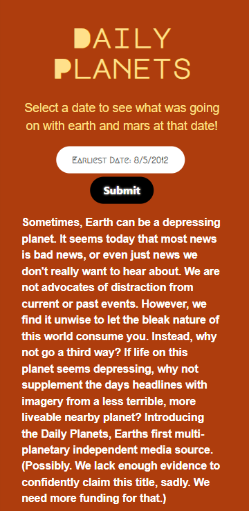

# The Daily Planets | A way to keep your perspective expanded.

## Description

> Lately the news can seem pretty bleak.  A look at the days headlines can make Earth's gravity feel even heavier.  Sometimes a little perspective can help make the medicine go down.  Enjoy a selection of photos from the Mars Curiosity rover along with your news.

## Usage

> Pick a date from 2021 to the present, and you will be presented with a Top new story from that date, as well as a small sampling of photos from the mars curiosity rover.  (Note, not all dates have photos available, with more refinement, we could only include dates that have rover photos.)

## Technologies Used

 -  ***TheNews*** API: https://www.thenewsapi.com/documentation

 - ***Mars Rover Photo*** API: https://github.com/chrisccerami/mars-photo-api

 - ***Bulma*** Framework: https://bulma.io/documentation/

 - ***jQuery***: https://jquery.com/

 - ***jQuery*** UI: https://jqueryui.com/

 - The Super Cool ***Palatte Generator***: https://tools.picsart.com/color/palette-from-image/

 - ***Google*** Fonts: https://fonts.google.com/

## Page Link

> https://blchase215.github.io/the-daily-planets/

### Mobile Site

### Desktop Site

# The Developers

Team ***BESC*** is:  

- **Chase** Stratton  :  ***CSS*** guru  
- **Eric** Courter    :  ***Bulma*** wrangler  
- **Sean** Dillon     :  ***jQuery*** scientist  
- **Brian** Chase     :  ***API*** investigator  
